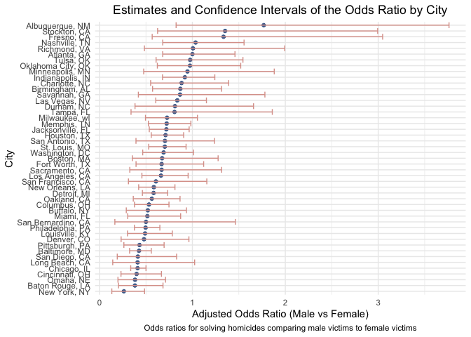

p8105_hw6_lx2346
================
linshan
2024-11-17

Load the packages

``` r
library(tidyverse)
```

    ## ── Attaching core tidyverse packages ──────────────────────── tidyverse 2.0.0 ──
    ## ✔ dplyr     1.1.4     ✔ readr     2.1.5
    ## ✔ forcats   1.0.0     ✔ stringr   1.5.1
    ## ✔ ggplot2   3.5.1     ✔ tibble    3.2.1
    ## ✔ lubridate 1.9.3     ✔ tidyr     1.3.1
    ## ✔ purrr     1.0.2     
    ## ── Conflicts ────────────────────────────────────────── tidyverse_conflicts() ──
    ## ✖ dplyr::filter() masks stats::filter()
    ## ✖ dplyr::lag()    masks stats::lag()
    ## ℹ Use the conflicted package (<http://conflicted.r-lib.org/>) to force all conflicts to become errors

``` r
library(modelr)
```

## Problem 1

Use the code chunk below to download the data.

``` r
weather_df = 
  rnoaa::meteo_pull_monitors(
    c("USW00094728"),
    var = c("PRCP", "TMIN", "TMAX"), 
    date_min = "2017-01-01",
    date_max = "2017-12-31") |>
  mutate(
    name = recode(id, USW00094728 = "CentralPark_NY"),
    tmin = tmin / 10,
    tmax = tmax / 10) |>
  select(name, id, everything())
```

    ## using cached file: /Users/linshanxie/Library/Caches/org.R-project.R/R/rnoaa/noaa_ghcnd/USW00094728.dly

    ## date created (size, mb): 2024-09-26 11:21:54.721264 (8.651)

    ## file min/max dates: 1869-01-01 / 2024-09-30

Generate 5000 bootstrap samples.

``` r
boot_straps = 
  weather_df |>
  modelr::bootstrap(5000)|>
  mutate(
    strap = map(strap, as_tibble),
    models = map(strap, \(df) lm(tmax ~ tmin, data = df))) 
```

Clean the result and produce estimates of 𝑟̂2 ,𝛽̂0 and 𝛽

``` r
weather_result = 
  boot_straps |>
  mutate(result_1 = map(models, broom::tidy)) |>
  unnest(result_1) |>
  select(.id, models, term, estimate) |>
  pivot_wider(
    id_cols = c(.id, models),
    names_from = term,
    values_from = estimate
  ) |>
  select(.id, models,
    beta0 = `(Intercept)`,
    beta1 = tmin) |>
  mutate(
    log_b0_b1 = log(beta0 * beta1)
  ) |>
  mutate(result_2 = map(models, broom::glance)) |>
  unnest(result_2) |>
  select(.id, beta0, beta1, log_b0_b1, r.squared)
```

## Plot the distribution of your estimates, and describe these in words

``` r
weather_result |>
  ggplot(aes(x = r.squared)) + 
  geom_histogram(binwidth = 0.01, fill = "skyblue", color = "black") +
  theme_minimal() +
  labs(title = "Bootstrap Distribution of R-squared", x = "R-squared")
```

<!-- -->

``` r
weather_result |>
  ggplot(aes(x = log_b0_b1)) + 
  geom_histogram(binwidth = 0.01, fill = "pink", color = "black") +
  theme_minimal() +
  labs(title = "Bootstrap Distribution of log(β0 * β1)", x = "log(β0 * β1)")
```

<!-- -->  
**Comment**:It can be observed that the R-squared values are
concentrated around 0.9, approximately forming a bell shape. The
distribution of log(β₀ \* β₁) ranges from 1.90 to 2.10, with a peak
around 2.01, also exhibiting a bell-shaped pattern.

## Identify the 2.5% and 97.5% quantiles to provide a 95% confidence interval for 𝑟̂2 and log(𝛽̂0∗𝛽̂1).

``` r
ci_r2 = quantile(weather_result$r.squared, c(0.025, 0.975))
ci_log_beta = quantile(weather_result$log_b0_b1, c(0.025, 0.975))
tibble(
  ci_r2 = ci_r2,
  ci_log_beta = ci_log_beta)
```

    ## # A tibble: 2 × 2
    ##   ci_r2 ci_log_beta
    ##   <dbl>       <dbl>
    ## 1 0.894        1.96
    ## 2 0.927        2.06

## Problem 2

Import the data

``` r
homicides = read_csv("./data/homicide-data.csv", na = c(".", "", "NA"))
```

    ## Rows: 52179 Columns: 12
    ## ── Column specification ────────────────────────────────────────────────────────
    ## Delimiter: ","
    ## chr (9): uid, victim_last, victim_first, victim_race, victim_age, victim_sex...
    ## dbl (3): reported_date, lat, lon
    ## 
    ## ℹ Use `spec()` to retrieve the full column specification for this data.
    ## ℹ Specify the column types or set `show_col_types = FALSE` to quiet this message.

Create a city_state variable (e.g. “Baltimore, MD”), and a binary
variable indicating whether the homicide is solved.

``` r
homicides = homicides |>
  mutate(city_state = paste(city, state, sep = ", "),
         solve = ifelse(disposition %in% c("Closed without arrest", "Open/No arrest"), 0, 1))
```

Omit cities & Limit victim_race in white or black & Be sure that
victim_age is numeric

``` r
homicides = homicides |>
  filter(!(city_state %in% c("Dallas, TX", "Phoenix, AZ", "Kansas City, MO", "Tulsa, AL"))) |>
  filter(victim_race %in% c("White", "Black")) |>
  mutate(victim_age = as.numeric(victim_age, na.rm =TRUE))
```

    ## Warning: There was 1 warning in `mutate()`.
    ## ℹ In argument: `victim_age = as.numeric(victim_age, na.rm = TRUE)`.
    ## Caused by warning:
    ## ! NAs introduced by coercion

### Test for Baltimore, MD

``` r
baltimore = homicides |>
  filter(city_state == "Baltimore, MD")
model_baltimore = glm(solve ~ victim_age + victim_sex + victim_race, data = baltimore, family = binomial)
baltimore_tidy = broom::tidy(model_baltimore) |>
  mutate(odds_ratio = exp(estimate))
ci = exp(confint(model_baltimore))
```

    ## Waiting for profiling to be done...

``` r
ci_sex = ci["victim_sexMale", ]
sex_or = baltimore_tidy |>
  filter(term == "victim_sexMale") |>
  pull(odds_ratio) 

tibble(sex_or = sex_or,
       sex_ci_ll = ci_sex[1],
       sex_ci_ul = ci_sex[2])
```

    ## # A tibble: 1 × 3
    ##   sex_or sex_ci_ll sex_ci_ul
    ##    <dbl>     <dbl>     <dbl>
    ## 1  0.426     0.324     0.558

### Now run glm for each of the cities in your dataset, and extract the adjusted odds ratio (and CI) for solving homicides comparing male victims to female victims.

``` r
glm_data = homicides |>
  select(solve, victim_race, victim_age, victim_sex, city_state) |>
  group_by(city_state) |>
  nest()
```

``` r
odd_ci = function(x) {
  model_tidy = broom::tidy(x) |>
    mutate(odds_ratio = exp(estimate))
  
  ci = exp(confint(x))
  
  ci_sex = ci["victim_sexMale",]
  
  sex_or = model_tidy |>
    filter(term == "victim_sexMale") |>
    pull(odds_ratio)
  
  out_df = tibble(
    sex_or = sex_or,
    sex_ci_ll = ci_sex[1],
    sex_ci_ul = ci_sex[2]
  )
  
}
```

``` r
glm_model = glm_data |>
  mutate(
    model = map(data, \(df) glm(solve ~ victim_race + victim_age + victim_sex, data = df, family = binomial)),
    result = map(model, odd_ci)) |>
  select(city_state, result) |>
  unnest(result)
```

    ## Waiting for profiling to be done...
    ## Waiting for profiling to be done...
    ## Waiting for profiling to be done...
    ## Waiting for profiling to be done...
    ## Waiting for profiling to be done...
    ## Waiting for profiling to be done...
    ## Waiting for profiling to be done...
    ## Waiting for profiling to be done...
    ## Waiting for profiling to be done...
    ## Waiting for profiling to be done...
    ## Waiting for profiling to be done...
    ## Waiting for profiling to be done...
    ## Waiting for profiling to be done...
    ## Waiting for profiling to be done...
    ## Waiting for profiling to be done...
    ## Waiting for profiling to be done...
    ## Waiting for profiling to be done...
    ## Waiting for profiling to be done...
    ## Waiting for profiling to be done...
    ## Waiting for profiling to be done...
    ## Waiting for profiling to be done...
    ## Waiting for profiling to be done...
    ## Waiting for profiling to be done...
    ## Waiting for profiling to be done...
    ## Waiting for profiling to be done...
    ## Waiting for profiling to be done...
    ## Waiting for profiling to be done...
    ## Waiting for profiling to be done...
    ## Waiting for profiling to be done...
    ## Waiting for profiling to be done...
    ## Waiting for profiling to be done...
    ## Waiting for profiling to be done...
    ## Waiting for profiling to be done...
    ## Waiting for profiling to be done...
    ## Waiting for profiling to be done...
    ## Waiting for profiling to be done...
    ## Waiting for profiling to be done...
    ## Waiting for profiling to be done...
    ## Waiting for profiling to be done...
    ## Waiting for profiling to be done...
    ## Waiting for profiling to be done...
    ## Waiting for profiling to be done...
    ## Waiting for profiling to be done...
    ## Waiting for profiling to be done...
    ## Waiting for profiling to be done...
    ## Waiting for profiling to be done...
    ## Waiting for profiling to be done...

    ## Warning: There were 43 warnings in `mutate()`.
    ## The first warning was:
    ## ℹ In argument: `result = map(model, odd_ci)`.
    ## ℹ In group 1: `city_state = "Albuquerque, NM"`.
    ## Caused by warning:
    ## ! glm.fit: fitted probabilities numerically 0 or 1 occurred
    ## ℹ Run `dplyr::last_dplyr_warnings()` to see the 42 remaining warnings.

``` r
glm_model |>
  knitr::kable()
```

| city_state         |    sex_or | sex_ci_ll | sex_ci_ul |
|:-------------------|----------:|----------:|----------:|
| Albuquerque, NM    | 1.7674995 | 0.8247081 | 3.7618600 |
| Atlanta, GA        | 1.0000771 | 0.6803477 | 1.4582575 |
| Baltimore, MD      | 0.4255117 | 0.3241908 | 0.5575508 |
| Baton Rouge, LA    | 0.3814393 | 0.2043481 | 0.6836343 |
| Birmingham, AL     | 0.8700153 | 0.5713814 | 1.3138409 |
| Boston, MA         | 0.6739912 | 0.3534469 | 1.2768225 |
| Buffalo, NY        | 0.5205704 | 0.2884416 | 0.9358300 |
| Charlotte, NC      | 0.8838976 | 0.5507440 | 1.3905954 |
| Chicago, IL        | 0.4100982 | 0.3361233 | 0.5008546 |
| Cincinnati, OH     | 0.3998277 | 0.2313767 | 0.6670456 |
| Columbus, OH       | 0.5324845 | 0.3770457 | 0.7479124 |
| Denver, CO         | 0.4790620 | 0.2327380 | 0.9624974 |
| Detroit, MI        | 0.5823472 | 0.4619454 | 0.7335458 |
| Durham, NC         | 0.8123514 | 0.3824420 | 1.6580169 |
| Fort Worth, TX     | 0.6689803 | 0.3935128 | 1.1211603 |
| Fresno, CA         | 1.3351647 | 0.5672553 | 3.0475080 |
| Houston, TX        | 0.7110264 | 0.5569844 | 0.9057376 |
| Indianapolis, IN   | 0.9187284 | 0.6784616 | 1.2413059 |
| Jacksonville, FL   | 0.7198144 | 0.5359236 | 0.9650986 |
| Las Vegas, NV      | 0.8373078 | 0.6058830 | 1.1510854 |
| Long Beach, CA     | 0.4102163 | 0.1427304 | 1.0241775 |
| Los Angeles, CA    | 0.6618816 | 0.4565014 | 0.9541036 |
| Louisville, KY     | 0.4905546 | 0.3014879 | 0.7836391 |
| Memphis, TN        | 0.7232194 | 0.5261210 | 0.9835973 |
| Miami, FL          | 0.5152379 | 0.3040214 | 0.8734480 |
| Milwaukee, wI      | 0.7271327 | 0.4951325 | 1.0542297 |
| Minneapolis, MN    | 0.9469587 | 0.4759016 | 1.8809745 |
| Nashville, TN      | 1.0342379 | 0.6807452 | 1.5559966 |
| New Orleans, LA    | 0.5849373 | 0.4218807 | 0.8121787 |
| New York, NY       | 0.2623978 | 0.1327512 | 0.4850117 |
| Oakland, CA        | 0.5630819 | 0.3637421 | 0.8671086 |
| Oklahoma City, OK  | 0.9740747 | 0.6228507 | 1.5199721 |
| Omaha, NE          | 0.3824861 | 0.1988357 | 0.7109316 |
| Philadelphia, PA   | 0.4962756 | 0.3760120 | 0.6498797 |
| Pittsburgh, PA     | 0.4307528 | 0.2626022 | 0.6955518 |
| Richmond, VA       | 1.0060520 | 0.4834671 | 1.9936248 |
| San Antonio, TX    | 0.7046200 | 0.3928179 | 1.2382509 |
| Sacramento, CA     | 0.6688418 | 0.3262733 | 1.3143888 |
| Savannah, GA       | 0.8669817 | 0.4185827 | 1.7802453 |
| San Bernardino, CA | 0.5003444 | 0.1655367 | 1.4623977 |
| San Diego, CA      | 0.4130248 | 0.1913527 | 0.8301847 |
| San Francisco, CA  | 0.6075362 | 0.3116925 | 1.1551470 |
| St. Louis, MO      | 0.7031665 | 0.5298505 | 0.9319005 |
| Stockton, CA       | 1.3517273 | 0.6256427 | 2.9941299 |
| Tampa, FL          | 0.8077029 | 0.3395253 | 1.8598834 |
| Tulsa, OK          | 0.9757694 | 0.6090664 | 1.5439356 |
| Washington, DC     | 0.6901713 | 0.4653608 | 1.0122516 |

### Create a plot that shows the estimated ORs and CIs for each city.

``` r
glm_model |>
  ggplot( aes(x = reorder(city_state, sex_or), y = sex_or)) +
  geom_point(size = 1.5, color = "#4c6d9a") + 
  geom_errorbar(aes(ymin = sex_ci_ll, 
                    ymax = sex_ci_ul), 
                width = 1, color = "#dca199") + 
  labs(x = "City", 
       y = "Adjusted Odds Ratio (Male vs Female)",
       title = "Estimates and Confidence Intervals of the Odds Ratio by City",
       caption = "Odds ratios for solving homicides comparing male victims to female victims") +
  theme_minimal() +
  coord_flip() +
  theme(plot.title = element_text(hjust = 0.5),
        plot.caption = element_text(hjust = 0.5))
```

<!-- -->  
**Comment**: The probability of solving homicide cases differs between
male and female victims across different cities. In most cities, the
probability of solving homicide cases for male victims is lower than
that for female victims. However, in only six cities—Albuquerque,
Atlanta, Fresno, Nashville, Stockton, and Richmond—the probability of
solving homicide cases for male victims is higher than that for female
victims.
