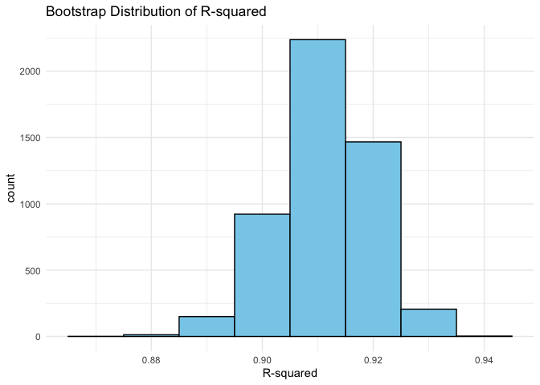
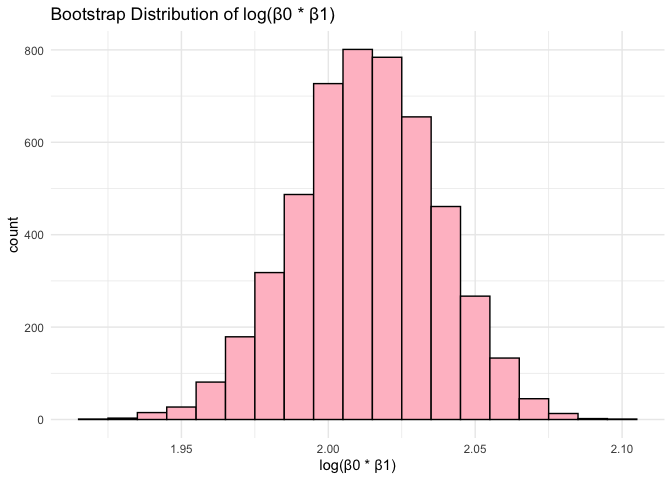

p8105_hw6_lx2346
================
linshan
2024-11-17

Load the packages

``` r
library(tidyverse)
```

    ## ── Attaching core tidyverse packages ──────────────────────── tidyverse 2.0.0 ──
    ## ✔ dplyr     1.1.4     ✔ readr     2.1.5
    ## ✔ forcats   1.0.0     ✔ stringr   1.5.1
    ## ✔ ggplot2   3.5.1     ✔ tibble    3.2.1
    ## ✔ lubridate 1.9.3     ✔ tidyr     1.3.1
    ## ✔ purrr     1.0.2     
    ## ── Conflicts ────────────────────────────────────────── tidyverse_conflicts() ──
    ## ✖ dplyr::filter() masks stats::filter()
    ## ✖ dplyr::lag()    masks stats::lag()
    ## ℹ Use the conflicted package (<http://conflicted.r-lib.org/>) to force all conflicts to become errors

``` r
library(modelr)
```

## Problem 1

Use the code chunk below to download the data.

``` r
weather_df = 
  rnoaa::meteo_pull_monitors(
    c("USW00094728"),
    var = c("PRCP", "TMIN", "TMAX"), 
    date_min = "2017-01-01",
    date_max = "2017-12-31") |>
  mutate(
    name = recode(id, USW00094728 = "CentralPark_NY"),
    tmin = tmin / 10,
    tmax = tmax / 10) |>
  select(name, id, everything())
```

    ## using cached file: /Users/linshanxie/Library/Caches/org.R-project.R/R/rnoaa/noaa_ghcnd/USW00094728.dly

    ## date created (size, mb): 2024-09-26 11:21:54.721264 (8.651)

    ## file min/max dates: 1869-01-01 / 2024-09-30

Generate 5000 bootstrap samples.

``` r
boot_straps = 
  weather_df |>
  modelr::bootstrap(5000)|>
  mutate(
    strap = map(strap, as_tibble),
    models = map(strap, \(df) lm(tmax ~ tmin, data = df))) 
```

Clean the result and produce estimates of 𝑟̂2 ,𝛽̂0 and 𝛽

``` r
weather_result = 
  boot_straps |>
  mutate(result_1 = map(models, broom::tidy)) |>
  unnest(result_1) |>
  select(.id, models, term, estimate) |>
  pivot_wider(
    id_cols = c(.id, models),
    names_from = term,
    values_from = estimate
  ) |>
  select(.id, models,
    beta0 = `(Intercept)`,
    beta1 = tmin) |>
  mutate(
    log_b0_b1 = log(beta0 * beta1)
  ) |>
  mutate(result_2 = map(models, broom::glance)) |>
  unnest(result_2) |>
  select(.id, beta0, beta1, log_b0_b1, r.squared)
```

## Plot the distribution of your estimates, and describe these in words

``` r
weather_result |>
  ggplot(aes(x = r.squared)) + 
  geom_histogram(binwidth = 0.01, fill = "skyblue", color = "black") +
  theme_minimal() +
  labs(title = "Bootstrap Distribution of R-squared", x = "R-squared")
```

<!-- -->

``` r
weather_result |>
  ggplot(aes(x = log_b0_b1)) + 
  geom_histogram(binwidth = 0.01, fill = "pink", color = "black") +
  theme_minimal() +
  labs(title = "Bootstrap Distribution of log(β0 * β1)", x = "log(β0 * β1)")
```

<!-- -->  
**Comment**:It can be observed that the R-squared values are
concentrated around 0.9, approximately forming a bell shape. The
distribution of log(β₀ \* β₁) ranges from 1.90 to 2.10, with a peak
around 2.01, also exhibiting a bell-shaped pattern.

## Identify the 2.5% and 97.5% quantiles to provide a 95% confidence interval for 𝑟̂2 and log(𝛽̂0∗𝛽̂1).

``` r
ci_r2 = quantile(weather_result$r.squared, c(0.025, 0.975))
ci_log_beta = quantile(weather_result$log_b0_b1, c(0.025, 0.975))
tibble(
  ci_r2 = ci_r2,
  ci_log_beta = ci_log_beta)
```

    ## # A tibble: 2 × 2
    ##   ci_r2 ci_log_beta
    ##   <dbl>       <dbl>
    ## 1 0.894        1.97
    ## 2 0.927        2.06
